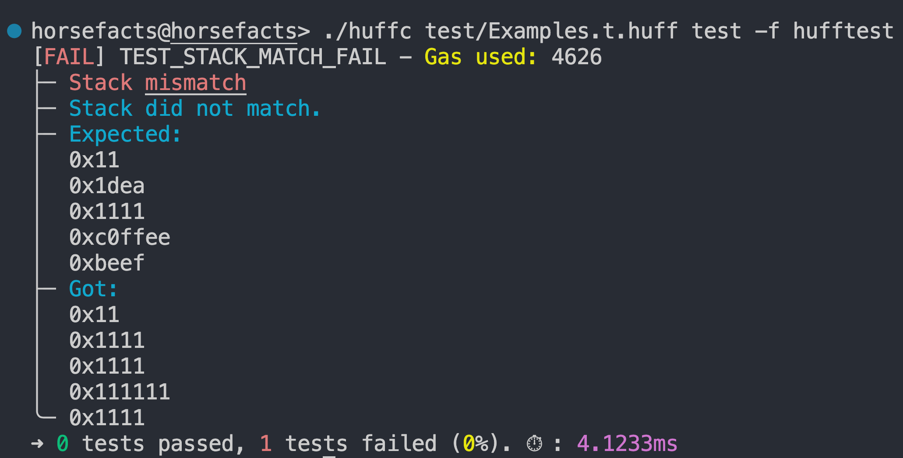

# huff-test


Better assertions for pure Huff tests.



## About huff-test

Did you know that `huffc` includes a [simple testrunner](https://docs.huff.sh/resources/cli/#test) for pure Huff tests?

Here's an example (failing) Huff test:

```
#define test TEST_EQ() = {
    0x02
    0x01
    ASSERT_EQ()
}
```

And here's its corresponding output.

```
[FAIL] TEST_EQUALITY   - Gas used: 50
├─ RETURN DATA
╰─ 4e487b710000000000000000000000000000000000000000000000000000000000000001
➜ 0 tests passed, 1 tests failed (0%). ⏱ : 1.4828ms
```

This simple testrunner is very useful for testing complicated macros, but it doesn't provide very much information about the failure. The encoded returndata is `Panic(1)`, which simply means "assertion failed".

The huff-test library provides improved macros for pure huff test assertions. Here's the same test using the huff-test `EXPECT_EQ` macro:

```
#define test TEST_EQUALITY() = {
    0x1
    0x2
    EXPECT_EQ(`Values should match`)
}
```

This produces the following test output, which describes why the test failed, prints the provided description, and logs out the left- and right-hand-side arguments to the assertion:

```
[FAIL] TEST_EQUALITY   - Gas used: 3361
├─ a == b not satisfied [stack]
├─ Values should match
├─ Left:
│  0x02
├─ Right:
╰─ 0x01
➜ 0 tests passed, 1 tests failed (0%). ⏱ : 603.7920µs
```

The huff-test assertion macros use the existing `LOG()` macro and cheatcode to log structured data about a test failure, and
a custom test reporter to display it as friendly human readable output.

huff-test includes 2-ary macros for basic comparisons:

- `EXPECT_EQ`
- `EXPECT_NOT_EQ`
- `EXPECT_GT`
- `EXPECT_GTE`
- `EXPECT_LT`
- `EXPECT_LTE`
- `EXPECT_MEM_EQ`
- `EXPECT_MEM_NOT_EQ`
- `EXPECT_STORAGE_EQ`
- `EXPECT_STORAGE_NOT_EQ`

Additionally, it includes an `EXPECT_STACK` macro to compare stack values up to 8 elements deep. This macro takes a `depth` argument between 3 and 8. For example, the following test compares 5 stack elements:

```
#define test TEST_STACK_VALUES() = {
    0x1111 0x111111 0x1111 0x1111 0x11
    0xbeef 0xc0ffee 0x1111 0x1dea 0x11
    EXPECT_STACK(0x5, `Stack did not match.`)
}
```

It produces the following output:

```
[FAIL] TEST_STACK_MATCH_FAIL - Gas used: 4626
├─ Stack mismatch
├─ Stack did not match.
├─ Expected:
│  0x11
│  0x1dea
│  0x1111
│  0xc0ffee
│  0xbeef
├─ Got:
│  0x11
│  0x1111
│  0x1111
│  0x111111
╰─ 0x1111
➜ 0 tests passed, 1 tests failed (0%). ⏱ : 3.1027ms
```

## Getting started

Install dependencies with forge:

```
$ forge install
```

Build patched `huffc` binary:

```
$ cargo build -Z unstable-options -r --bin huffc \
  --manifest-path=lib/huff-rs/Cargo.toml --out-dir .
```

Run tests:

```
$ ./huffc test/Examples.t.huff test -f hufftest
```

## How it works

I patched `huff-rs` with two changes: backtick literals and a new `hufftest` test formatter.

**Backtick literals** are like bytes32 literals in Solidity. They are syntactic sugar over Huff hex literals. The lexer [converts](https://github.com/huff-language/huff-rs/commit/117e464376a48221707c5c11520fa1ff6aec7143) whatever value is between backticks to hex and proceeds as if it's a hex literal.

```huff
#define test TEST_BACKTICK_EQUALITY() = {
    `I'm eth newbie..just learning`
    0x49276d20657468206e65776269652e2e6a757374206c6561726e696e67000000
    EXPECT_EQ(`Just another hex literal`)
}
```

These are not strictly necessary, but it's nice to use them to write error strings in tests and I've always wanted to add them.

The **hufftest reporter** is a new [reporter](https://github.com/huff-language/huff-rs/commit/820cc36581cd99ee8248bdc313295aa7599dc278) for the `huffc` testrunner.

Here's the output of a Huffmate test using the `ASSERT_EQ()` macro:

```
[FAIL] TEST_HUFFMATE_FAIL - Gas used: 50
├─ RETURN DATA
╰─ 4e487b710000000000000000000000000000000000000000000000000000000000000001
➜ 0 tests passed, 1 tests failed (0%). ⏱ : 278.8750µs
```

The returndata in this example is `Panic(1)`, i.e. an assertion failure. This doesn't provide much information about what caused the failure, just that an assertion failed and threw a panic.

Here's the output of a huff-test test using the default formatter:

```
$ ./huffc test/Examples.t.huff test -m TEST_STACK_EQUALITY_FAIL
[FAIL] TEST_STACK_EQUALITY_FAIL - Gas used: 3361
├─ RETURN DATA
├─ 08c379a00000000000000000000000000000000000000000000000000000000000000020000000000000000000000000000000000000000000000000000000000000001c61203d3d2062206e6f7420736174697366696564205b737461636b5d0000000000000000000000000000000000000000000000000000000000000000
├─ LOGS
├─ [PC: 146]: 0x32d5ab9656616c7565732073686f756c64206d61746368000000000000000000
├─ [PC: 243]: 0x32d5ab964c6566743a0000000000000000000000000000000000000000000000
├─ [PC: 267]: 0x42616e616e610000000000000000000000000000000000000000000000000000
├─ [PC: 364]: 0x32d5ab9652696768743a00000000000000000000000000000000000000000000
╰─ [PC: 388]: 0x4170706c65000000000000000000000000000000000000000000000000000000
➜ 0 tests passed, 1 tests failed (0%). ⏱ : 630.9590µs
```

The huff-test `EXPECT_` macros use huffmate `REQUIRE()` rather than `ASSERT()`, which returns an `Error(string)` rather than `Panic(1)`. This lets us pass on a more useful message in the returndata.

Additionally, huff-test expectations use the huffmate `LOG()` macro and cheatcode to log additional data. Logs prefixed with `0x32d5ab96` (the selector for `Log(bytes32)`) are interpreted as messages, while other logs are interpreted as values. This allows them to print structured data while remaining backwards compatible with other reporters.

Run the same test with the `-f hufftest` flag to use the huff-test reporter:

```
$ ./huffc test/Examples.t.huff test -m TEST_STACK_EQUALITY_FAIL -f hufftest
[FAIL] TEST_STACK_EQUALITY_FAIL - Gas used: 3361
├─ a == b not satisfied [stack]
├─ Values should match
├─ Left:
│  0x42616e616e610000000000000000000000000000000000000000000000000000
├─ Right:
╰─ 0x4170706c65000000000000000000000000000000000000000000000000000000
➜ 0 tests passed, 1 tests failed (0%). ⏱ : 638.3340µs
```

The log values are decoded into human readable test output that shows more information about the failed assertion.
